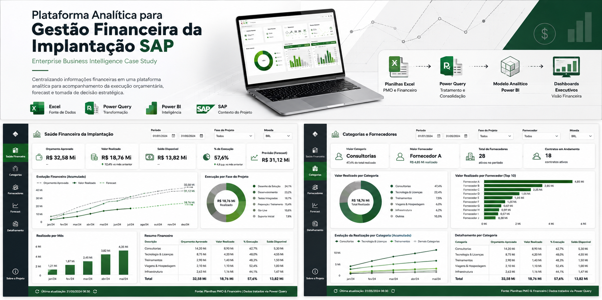
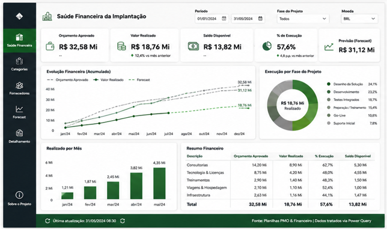
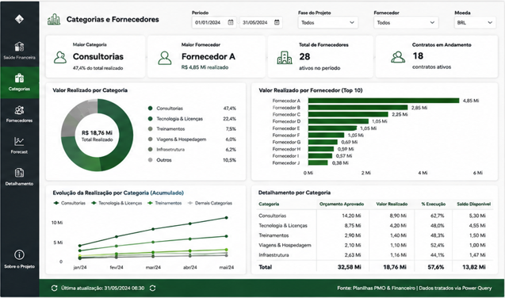

# Plataforma Analítica para Gestão Financeira da Implantação SAP

### Enterprise Business Intelligence Case Study

> Como centralizei o controle financeiro de uma implantação SAP em uma plataforma analítica utilizando Power Query, DAX e Power BI.

 

---

# 📌 Visão Geral

A implantação do SAP S/4HANA envolvia consultorias, fornecedores, treinamentos, viagens, infraestrutura e licenciamento — um controle financeiro robusto, porém mantido principalmente em planilhas Excel pelo PMO e pela equipe financeira, o que dificultava o acompanhamento gerencial da execução orçamentária.

Para resolver esse cenário, desenvolvi uma plataforma analítica capaz de centralizar as informações financeiras em um único ambiente, com visão executiva da saúde financeira da implantação, sem substituir o controle do PMO.

---

# 🎯 O Desafio

Os principais desafios encontrados eram:

- Controle financeiro disperso em diversas planilhas Excel;
- Elevado esforço manual de consolidação;
- Pouca visibilidade sobre orçamento realizado versus aprovado;
- Ausência de indicadores de forecast financeiro;
- Dificuldade de acompanhamento por categoria de despesa e fornecedor.

---

# 💡 A Solução

Foi desenvolvida uma solução completa de Business Intelligence composta por:

- Preparação dos dados em Power Query (padronização, tratamento de inconsistências, consolidação de planilhas);
- Modelagem dimensional no Power BI;
- Regras de negócio em DAX para indicadores de execução e forecast;
- Dashboards executivos de saúde financeira da implantação.

---

# 🏗 Arquitetura da Solução

## Fonte de Dados

- Planilhas Excel do PMO e da equipe financeira

## Tratamento

Consolidação e padronização das planilhas realizada em Power Query, tratando inconsistências e unificando categorias de despesa antes da modelagem.

## Camada Analítica

Modelagem dimensional no Power BI, com regras de negócio em DAX para cálculo de percentual de execução, saldo disponível e forecast financeiro.

## Visualização

Toda a camada analítica foi disponibilizada através do Power BI.

---

# 📊 Dashboards Desenvolvidos

## Saúde Financeira da Implantação

Visão executiva do orçamento aprovado, valor realizado, saldo disponível e percentual de execução, com evolução financeira acumulada (orçado x realizado x forecast), execução por fase do projeto e resumo por categoria de despesa.

---

## Categorias e Fornecedores

Detalhamento do valor realizado por categoria de despesa e por fornecedor, com evolução acumulada por categoria e visão consolidada de contratos em andamento.

---

# 📈 Resultados

Principais ganhos obtidos:

- Eliminação de grande parte da consolidação manual;
- Atualização muito mais simples dos dashboards;
- Maior confiabilidade das informações financeiras;
- Fortalecimento da governança financeira do projeto;
- Visão executiva única da saúde financeira da implantação.

---

# 🛠 Stack Tecnológica

### Business Intelligence

- Power BI
- DAX
- Power Query

### Ferramentas

- Excel
- SAP

---

# 📚 Principais Aprendizados

Este projeto reforçou que grande parte do valor de uma solução financeira não está apenas nos dashboards, mas na qualidade do tratamento de dados na origem — especialmente ao consolidar planilhas mantidas manualmente por diferentes equipes.

Também evidenciou a importância de manter a plataforma analítica como apoio à decisão, sem substituir os controles e responsabilidades já estabelecidos do PMO.

---

# 🔒 Confidencialidade

Este estudo de caso foi adaptado para fins de portfólio.

Alguns detalhes operacionais foram abstraídos e todos os dados apresentados são ilustrativos ou anonimizados para preservar a confidencialidade do projeto original.

---

## 👤 Autor

**Paulo Oliveira**

### Data Solutions • Analytics • AI

- LinkedIn: https://www.linkedin.com/in/paulo-emilio
- Portfólio: https://paulo-emilio.github.io
- GitHub: https://github.com/paulo-emilio
