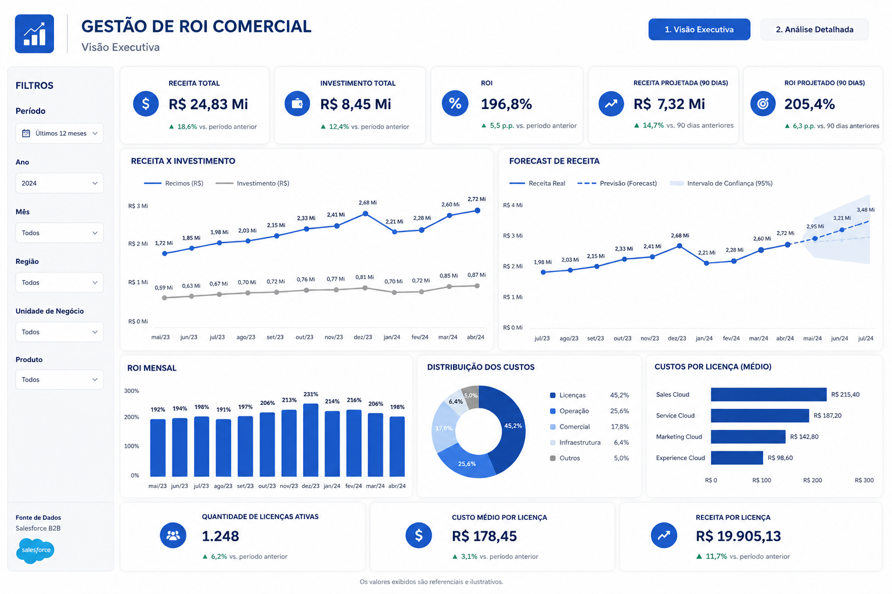
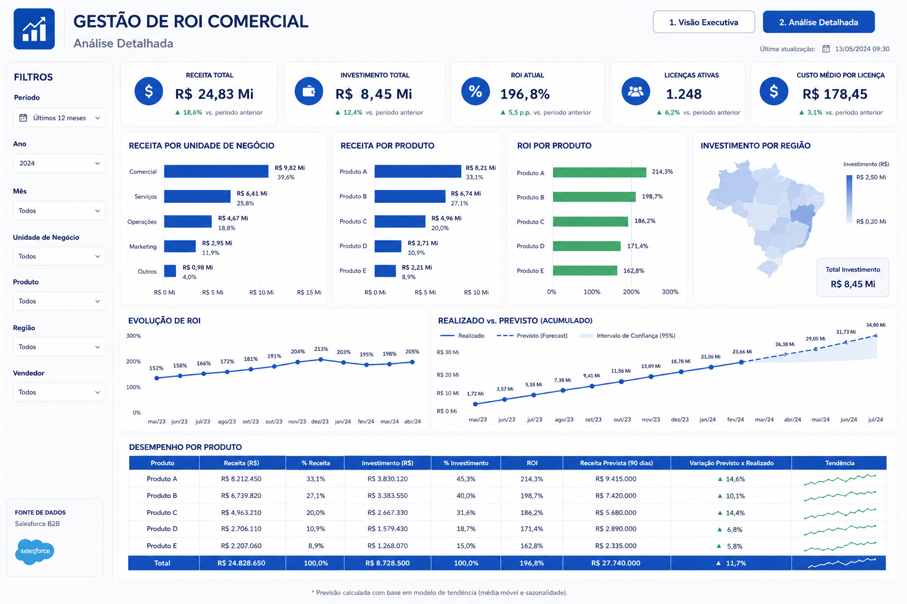

# Plataforma Analítica para Gestão de ROI Comercial

## Visão Geral

Empresas investem continuamente em plataformas comerciais, equipes de vendas e tecnologias para ampliar receitas e acelerar o crescimento do negócio. Entretanto, sem uma visão consolidada dos investimentos e dos resultados obtidos, torna-se difícil responder uma pergunta essencial para a tomada de decisão estratégica:

> O investimento realizado está gerando o retorno esperado?

Para responder essa necessidade, foi desenvolvida uma plataforma analítica baseada em Power BI, consolidando dados da operação comercial em indicadores executivos capazes de acompanhar receitas, investimentos, retorno sobre investimento (ROI) e projeções futuras.

A solução transformou análises que anteriormente dependiam de planilhas e consolidações manuais em um painel executivo atualizado continuamente, permitindo uma visão centralizada da performance financeira da operação comercial.

---

## Objetivos

- Consolidar indicadores financeiros e comerciais em uma única plataforma.
- Monitorar continuamente o ROI da operação.
- Comparar investimentos e receitas ao longo do tempo.
- Projetar resultados futuros utilizando modelos de tendência.
- Apoiar decisões estratégicas da diretoria.

---

## Arquitetura da Solução

A arquitetura foi construída sobre uma plataforma moderna de dados, utilizando o Salesforce como origem das informações comerciais.

Após a ingestão e armazenamento no Data Lake, os dados eram tratados e organizados na camada analítica por meio de processos automatizados, disponibilizando um Data Mart otimizado para consumo no Power BI.

Minha atuação concentrou-se na camada analítica da solução, realizando consultas SQL, preparação dos dados para o Data Mart e desenvolvimento dos dashboards executivos em Power BI.

---

## Tecnologias Utilizadas

| Tecnologia | Finalidade |
|------------|------------|
| Power BI | Dashboards executivos |
| SQL | Consultas e preparação analítica |
| Python | Processamento de dados |
| Apache Airflow | Orquestração dos pipelines |
| Salesforce B2B | Origem dos dados comerciais |
| Data Lake | Armazenamento dos dados |
| Data Mart | Camada analítica |

---

# Dashboard Executivo

A página principal foi desenvolvida para fornecer uma visão executiva da operação comercial, permitindo que gestores acompanhassem rapidamente os principais indicadores financeiros responsáveis por medir o retorno dos investimentos realizados.

Entre os principais indicadores apresentados estavam:

- Receita Total
- Investimento Total
- ROI Atual
- Receita Projetada
- ROI Projetado
- Receita por Licença
- Custo Médio por Licença

Além dos KPIs, o painel apresentava gráficos de tendência que permitiam comparar a evolução das receitas, investimentos e o comportamento esperado da operação nos meses seguintes através de modelos de Forecast.

---

# Dashboard Analítico

Enquanto o painel executivo respondia rapidamente ao desempenho geral da operação, esta página permitia aprofundar a análise dos resultados.

Os indicadores podiam ser explorados através de diversos filtros, possibilitando identificar quais áreas concentravam maiores investimentos, quais produtos apresentavam melhor retorno financeiro e como o ROI se comportava em diferentes segmentos da operação.

A tabela analítica consolidava todas essas informações em uma única visão, facilitando análises detalhadas durante reuniões executivas.

---

## Principais Indicadores

- ROI Comercial
- Receita Total
- Investimento Total
- Receita Projetada
- Forecast Financeiro
- Receita por Produto
- Receita por Unidade de Negócio
- Investimento por Região
- Receita por Licença
- Custos por Licença
- Evolução do ROI

---

## Resultados Obtidos

A implantação da plataforma proporcionou diversos ganhos para a gestão comercial:

- Eliminação de controles paralelos em planilhas.
- Centralização dos indicadores estratégicos em um único ambiente.
- Redução do tempo necessário para análises financeiras.
- Acompanhamento contínuo do retorno sobre investimentos.
- Maior confiabilidade das informações utilizadas pela diretoria.
- Apoio à tomada de decisão baseada em dados.

---

## Aprendizados

Este projeto reforçou a importância da construção de indicadores orientados ao negócio.

Mais do que desenvolver dashboards, o principal desafio foi traduzir informações comerciais em métricas capazes de apoiar decisões estratégicas relacionadas a investimentos, crescimento e rentabilidade.

Também permitiu aprofundar conhecimentos em modelagem analítica, visualização de dados executivos, integração de informações provenientes do Salesforce e construção de indicadores financeiros voltados para acompanhamento de ROI.

---

## Confidencialidade

Os dados apresentados neste repositório possuem finalidade exclusivamente demonstrativa.

Todas as informações exibidas foram anonimizadas, adaptadas ou recriadas para preservar a confidencialidade da organização e de seus processos internos, mantendo apenas a estrutura técnica e analítica da solução originalmente desenvolvida.

---

## Autor

**Paulo Emílio Oliveira**

Analista de Dados | Business Intelligence | Power BI | SQL | Python
