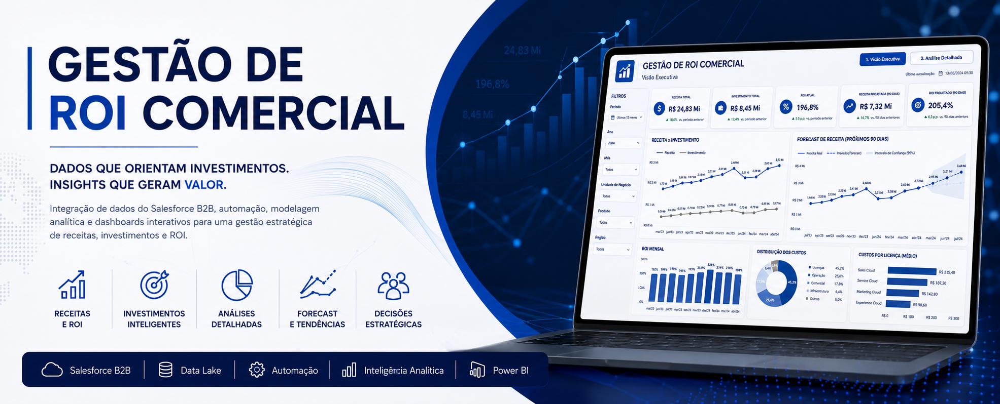
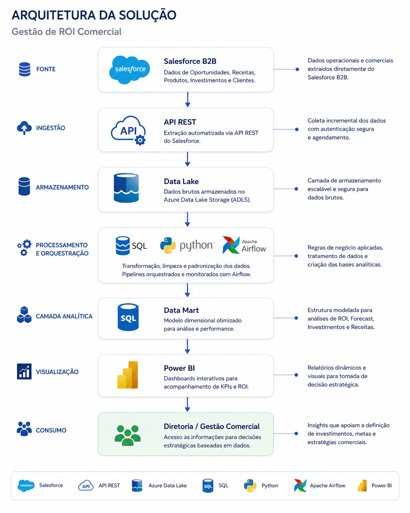

# Otimização de Custos de Licenciamento ERP

  

## Visão Geral

Este projeto apresenta uma solução analítica desenvolvida para identificar oportunidades de otimização de custos com licenciamento de um sistema ERP, transformando grandes volumes de dados operacionais em informações estratégicas para apoio à tomada de decisão.

A solução foi construída utilizando pipelines de dados, processamento automatizado e dashboards analíticos para permitir uma visão completa dos custos de licenciamento, identificar usuários com potencial de reclassificação e priorizar oportunidades de redução de despesas.

---

  

---

# O Desafio

O ambiente possuía milhares de usuários distribuídos entre diversas áreas da empresa, cada um podendo possuir múltiplos perfis e diferentes níveis de acesso.

O principal desafio era identificar, de forma escalável, quais usuários realmente necessitavam de licenças de maior custo e quais poderiam ser reclassificados sem impacto operacional.

Antes da solução, essa análise era altamente manual, dificultando a identificação de oportunidades de economia e tornando o processo lento e sujeito a erros.

---

# Arquitetura da Solução

  

A arquitetura foi construída para transformar dados operacionais do ERP em informações analíticas consumidas pelo Power BI.

O fluxo da solução contemplava:

- Extração de dados relacionados a usuários, perfis, licenças e acessos;
- Consultas SQL utilizando CTEs para consolidação e tratamento das informações;
- Orquestração das cargas por meio do Apache Airflow;
- Organização dos dados em camadas Silver e Gold;
- Publicação em ambiente analítico para consumo pelo Power BI.

Essa estrutura permitia atualizações recorrentes, padronização das informações e suporte às análises estratégicas.

---

# Dashboards

## Dashboard Executivo

  

O dashboard executivo consolidava os principais indicadores relacionados aos custos de licenciamento, permitindo uma visão geral do cenário da organização.

Principais análises:

- custo total de licenciamento;
- distribuição das licenças;
- custos por área;
- evolução dos gastos;
- usuários com maior impacto financeiro;
- potencial estimado de economia.

---

## Dashboard de Oportunidades

  

Após identificar as áreas com maior concentração de custos, a solução priorizava automaticamente as melhores oportunidades de redução.

A análise combinava fatores como:

- impacto financeiro;
- facilidade de implementação;
- quantidade de funcionalidades utilizadas;
- quantidade de funcionalidades críticas;
- potencial de economia.

Essa abordagem permitia priorizar ações de maior retorno com menor esforço operacional.

---

## Dashboard de Perfis e Transações

  

Este dashboard permitia navegar do nível mais alto da análise até o detalhe das transações responsáveis pelo enquadramento de cada licença.

Fluxo analítico:

Área

↓

Usuário

↓

Perfil (Role)

↓

Transações

↓

Nível da Licença

↓

Oportunidade de Redução

Essa visão facilitava a identificação de casos onde poucas transações elevavam o custo da licença, possibilitando revisões mais precisas e fundamentadas.

---

# Tecnologias Utilizadas

### Business Intelligence

- Power BI

### Engenharia de Dados

- SQL
- Apache Airflow

### Modelagem de Dados

- Camadas Silver
- Camadas Gold
- Data Lake
- Data Warehouse
- Data Mart

### Bancos de Dados

- PostgreSQL
- MySQL

### Conceitos Aplicados

- ETL
- ELT
- Data Warehouse
- Governança de Dados
- Data Analytics
- Modelagem Dimensional
- Análise de Custos
- Business Intelligence

---

# Resultados

A solução proporcionou uma visão centralizada do ambiente de licenciamento, permitindo identificar oportunidades de otimização que antes demandavam análises manuais.

Entre os principais ganhos obtidos destacam-se:

- centralização das informações de licenciamento;
- atualização automatizada dos dados;
- identificação de usuários com potencial de reclassificação;
- priorização das melhores oportunidades de economia;
- maior suporte às decisões relacionadas à gestão de licenças;
- fortalecimento da governança sobre acessos e custos.

---

# Principais Aprendizados

Durante o desenvolvimento deste projeto foi possível aprofundar conhecimentos em:

- arquitetura analítica para Business Intelligence;
- construção de consultas SQL complexas utilizando CTEs;
- modelagem de dados para ambientes analíticos;
- orquestração de pipelines com Apache Airflow;
- criação de dashboards executivos focados em tomada de decisão;
- análise de custos baseada em dados;
- comunicação de insights para áreas de negócio.

---

# Confidencialidade

Este case foi adaptado para fins de portfólio.

Todas as informações sensíveis foram anonimizadas, incluindo nomes de usuários, áreas, estruturas organizacionais, valores específicos e demais dados confidenciais.

O objetivo deste projeto é demonstrar a arquitetura da solução, a abordagem analítica utilizada e as técnicas aplicadas durante seu desenvolvimento, preservando integralmente a confidencialidade do ambiente corporativo.

---

## Autor

**Paulo Oliveira**

**Data Solutions • Analytics • AI**

GitHub:
https://github.com/paulo-emilio

LinkedIn:
https://linkedin.com/in/paulo-emilio-oliveira
