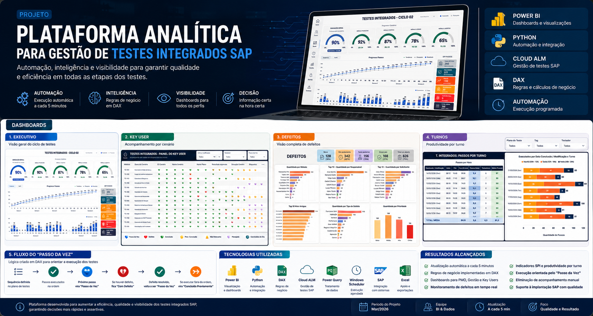
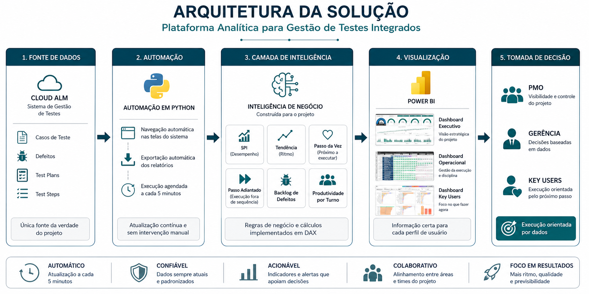
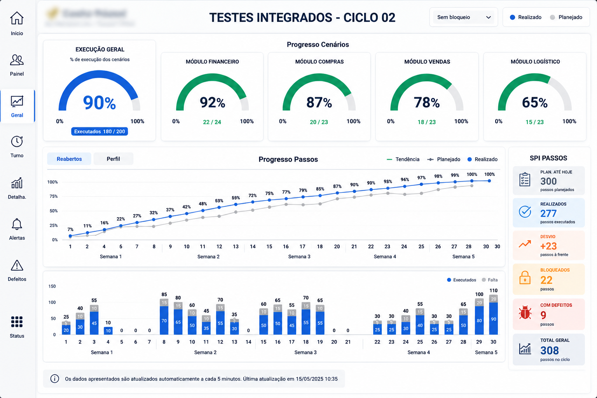
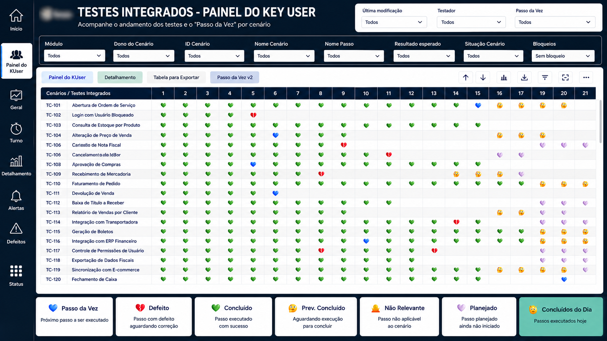
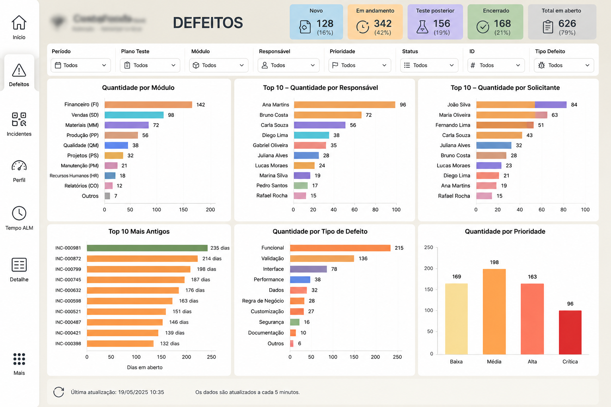
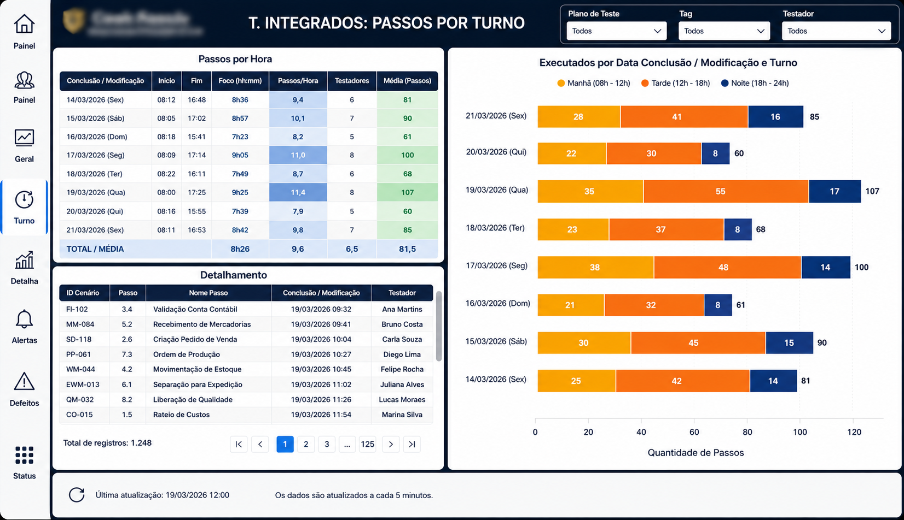
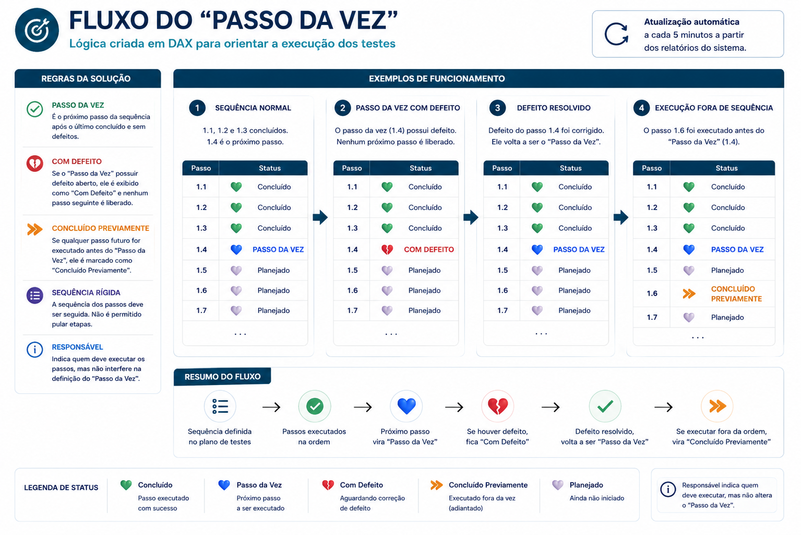

# Plataforma Analítica para Gestão de Testes Integrados SAP

### Automação, Inteligência de Negócio e Dashboards para acompanhamento de Testes Integrados utilizando SAP Cloud ALM, Python e Power BI.

---

# Sobre o projeto

Durante projetos de implantação do **SAP S/4HANA**, centenas de cenários de testes precisam ser executados diariamente por diversas áreas da empresa.

Embora o SAP Cloud ALM seja responsável pelo gerenciamento dos testes, acompanhar a evolução do projeto apenas pela ferramenta torna a tomada de decisão difícil, principalmente quando existem:

- milhares de passos de teste;
- dezenas de Key Users;
- diversos módulos SAP;
- dependências entre cenários;
- defeitos abertos;
- necessidade de acompanhamento executivo.

Este projeto foi desenvolvido para transformar os dados operacionais do SAP Cloud ALM em uma plataforma analítica capaz de fornecer indicadores estratégicos, operacionais e gerenciais em tempo praticamente real.

Toda a atualização ocorre automaticamente a cada **5 minutos**, permitindo que gestores, PMO e Key Users acompanhem o andamento do projeto através de dashboards específicos para cada perfil.

---

# Objetivos

- Automatizar a coleta de informações do SAP Cloud ALM;
- Centralizar todos os dados em um modelo analítico;
- Criar indicadores para gestão dos testes;
- Identificar gargalos durante a execução;
- Monitorar defeitos em tempo real;
- Orientar os Key Users através do conceito de **Passo da Vez**;
- Disponibilizar dashboards específicos para cada público.

---

# Arquitetura da Solução

A solução foi construída em cinco etapas principais:

## Fonte de Dados

- SAP Cloud ALM
- Casos de Teste
- Test Steps
- Test Plans
- Defeitos

---

## Automação

Toda a integração foi automatizada utilizando Python.

Responsável por:

- navegação automática;
- exportação dos relatórios;
- atualização programada;
- execução a cada cinco minutos.

---

## Camada Analítica

Toda a inteligência do projeto foi implementada utilizando DAX.

Principais regras de negócio:

- Passo da Vez
- Passo Concluído Previamente
- Indicadores SPI
- Produtividade
- Tendência
- Backlog de Defeitos

---

## Visualização

Toda a camada analítica foi disponibilizada através do Power BI.

Cada perfil possui um dashboard específico.

---

# Tecnologias Utilizadas

| Tecnologia | Finalidade |
|------------|------------|
| Power BI | Dashboards |
| DAX | Regras de Negócio |
| Python | Automação |
| SAP Cloud ALM | Fonte de Dados |
| Power Query | Tratamento |
| Windows Task Scheduler | Execução Agendada |
| Excel | Arquivos exportados |

---

# Dashboard Executivo

Dashboard destinado à gestão do projeto.

Principais indicadores:

- Percentual geral de execução;
- Progresso por módulo SAP;
- Evolução diária dos testes;
- SPI dos passos;
- Tendência do projeto;
- Bloqueios;
- Desvios;
- Passos executados;
- Passos com defeitos.

Permite acompanhar rapidamente a saúde geral do projeto.

---

# Dashboard Key User

Dashboard operacional desenvolvido para orientar a execução dos testes.

O principal diferencial deste projeto foi a criação da lógica do **Passo da Vez**, permitindo que cada cenário indique exatamente qual deve ser o próximo passo a ser executado.

Status disponíveis:

💚 Concluído

💙 Passo da Vez

❤️ Defeito

🧡 Concluído Previamente

💜 Planejado

🔥 Não Relevante

O dashboard também permite:

- localizar cenários;
- filtrar módulos;
- acompanhar bloqueios;
- identificar rapidamente onde existe atraso.

---

# Dashboard de Defeitos

Responsável pelo acompanhamento de todos os defeitos registrados durante os testes.

Principais indicadores:

- Defeitos por módulo;
- Responsáveis;
- Solicitantes;
- Prioridade;
- Tipo de defeito;
- Defeitos mais antigos;
- Status;
- Total em aberto.

---

# Dashboard de Passos por Turno

Dashboard utilizado para análise de produtividade das equipes.

Indicadores:

- Passos executados por turno;
- Média de passos por hora;
- Tempo de foco;
- Horário de início;
- Horário de término;
- Testadores ativos;
- Detalhamento de todas as execuções.

---

# Regra de Negócio — Passo da Vez

Um dos principais desafios do projeto foi criar uma lógica que orientasse automaticamente os usuários sobre qual passo deveria ser executado.

Toda essa regra foi construída utilizando DAX.

### Regras

### Passo da Vez

É o primeiro passo ainda não executado da sequência.

---

### Defeito

Caso o Passo da Vez possua um defeito aberto, ele deixa de ser executável.

Nenhum próximo passo é liberado até que o defeito seja resolvido.

---

### Defeito Resolvido

Quando o defeito é encerrado, o mesmo passo volta automaticamente a ser o Passo da Vez.

---

### Concluído Previamente

Caso um usuário execute um passo posterior antes do Passo da Vez, este passo é identificado como **Concluído Previamente**.

Dessa forma é possível identificar facilmente execuções fora da sequência planejada.

---

### Responsável

O responsável pelo passo não interfere na lógica.

Sua função é apenas indicar quem deverá executar determinada atividade.

---

# Principais Funcionalidades

- Atualização automática a cada 5 minutos;
- Integração automática com SAP Cloud ALM;
- Dashboards em tempo real;
- Regras de negócio implementadas em DAX;
- Indicadores executivos;
- Indicadores operacionais;
- Gestão de defeitos;
- Produtividade por turno;
- Navegação entre dashboards;
- Filtros dinâmicos;
- Exportação de dados;
- Monitoramento do Passo da Vez.

---

# Resultados Obtidos

A solução permitiu:

- centralizar informações do projeto;
- reduzir o tempo gasto na consolidação manual dos relatórios;
- aumentar a visibilidade da execução dos testes;
- facilitar o acompanhamento dos Key Users;
- acelerar a identificação de gargalos;
- monitorar defeitos em tempo real;
- melhorar o suporte às decisões do PMO e da gestão.

---

# Aprendizados

Durante o desenvolvimento deste projeto foram aplicados conhecimentos relacionados a:

- Modelagem de Dados;
- Power BI;
- DAX;
- Automação com Python;
- Integração de Sistemas;
- SAP Cloud ALM;
- UX para Dashboards;
- Business Intelligence;
- Indicadores de Projetos;
- Gestão de Testes Integrados.

---

# Autor

**Paulo Emílio Oliveira**

Analista de Dados | BI | Analytics

GitHub

https://github.com/paulo-emilio

LinkedIn

https://linkedin.com/in/pauloemiliooliveira

---

Se este projeto foi útil para você, deixe uma ⭐ no repositório.
