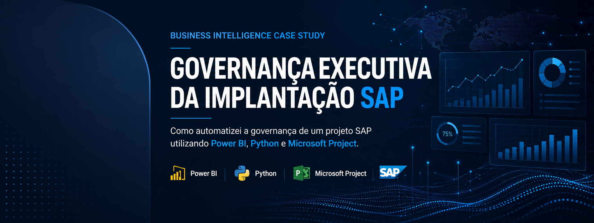
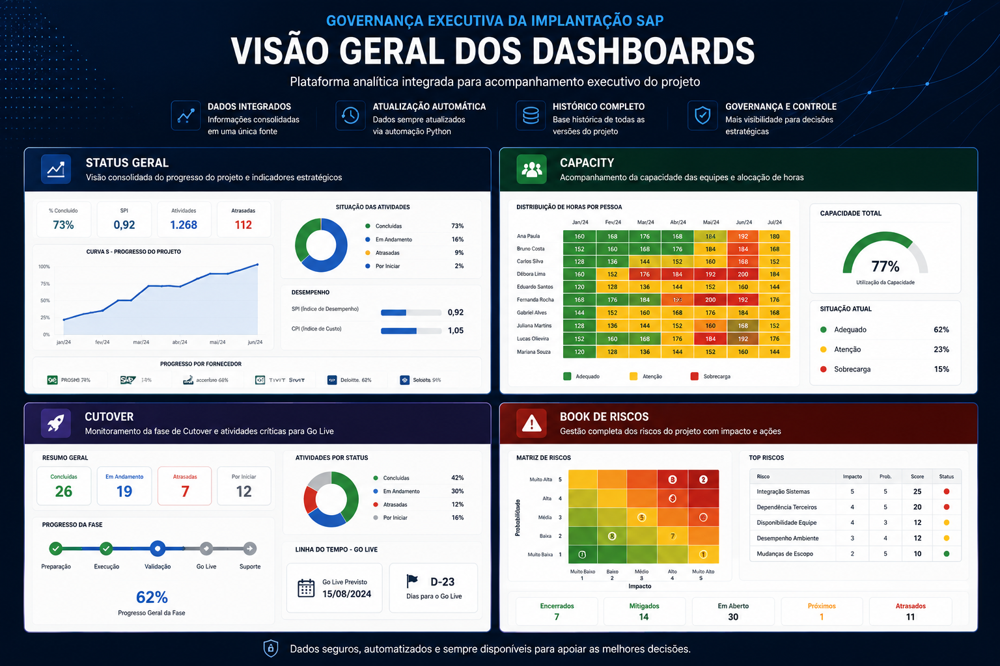
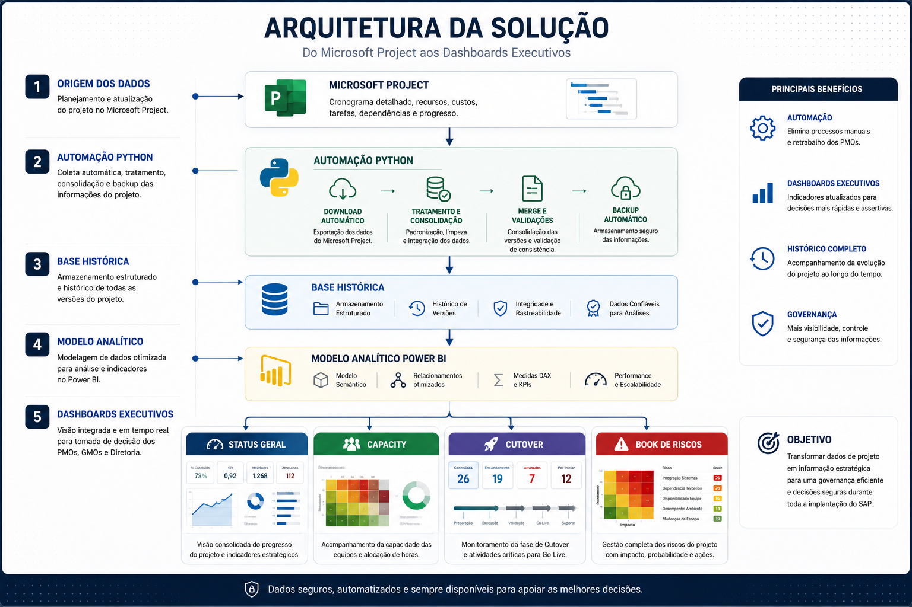
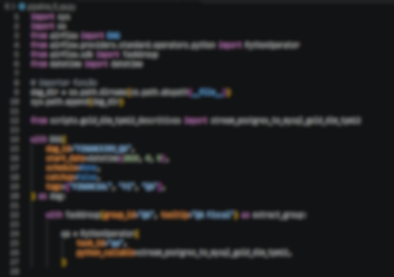
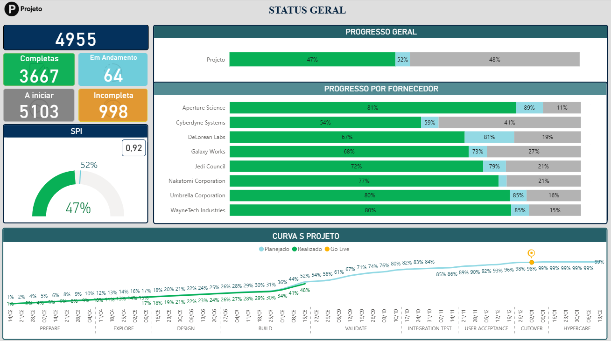
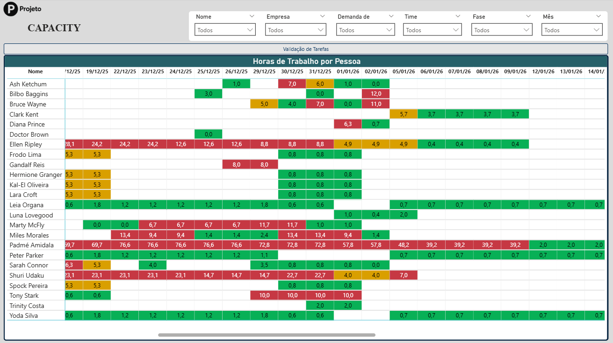
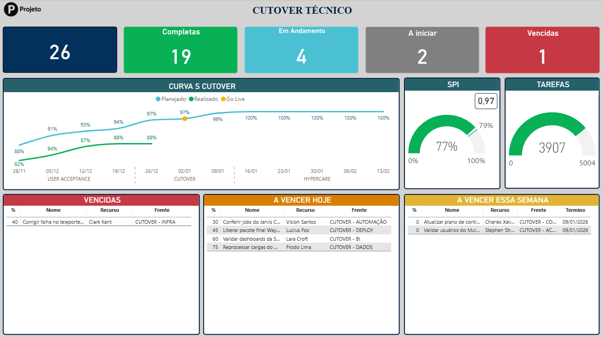
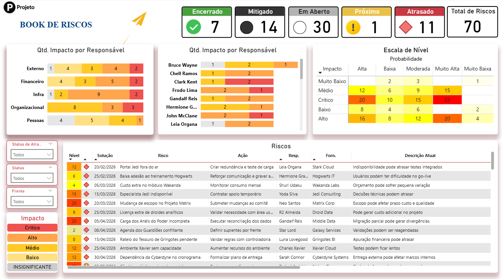

# Governança Executiva da Implantação SAP

### Enterprise Business Intelligence Case Study

> Como automatizei a governança de uma implantação SAP utilizando Power BI, Python e Microsoft Project.

 

---

# 📌 Visão Geral

Implantações SAP envolvem centenas de atividades, múltiplas equipes, fornecedores, cronogramas complexos e um grande volume de informações distribuídas entre diferentes ferramentas.

Nesse projeto, o acompanhamento executivo era realizado por meio de exportações manuais do Microsoft Project para Excel, consolidação de planilhas e preparação de apresentações para reuniões de acompanhamento.

Além do alto esforço operacional, qualquer atualização exigia repetir praticamente todo o processo.

Para resolver esse cenário, desenvolvi uma plataforma analítica capaz de automatizar a coleta dos dados, consolidar um histórico da implantação e disponibilizar dashboards executivos para acompanhamento em tempo real.

 

---

# 🎯 O Desafio

Os principais desafios encontrados eram:

- Atualização manual dos Status Reports;
- Consolidação de diversas planilhas;
- Elevado tempo de preparação das reuniões executivas;
- Pouca visibilidade sobre cronograma, riscos e capacidade das equipes;
- Ausência de histórico consolidado;
- Processo altamente dependente de trabalho manual.

---

# 💡 A Solução

Foi desenvolvida uma solução completa de Business Intelligence composta por:

- Dashboards executivos em Power BI;
- Automações em Python;
- Consolidação automática das informações;
- Histórico completo da implantação;
- Indicadores estratégicos para tomada de decisão;
- Atualização contínua dos dados.

Todo o processo passou a ser centralizado em um único ambiente analítico.

---

# 🏗 Arquitetura da Solução

A arquitetura foi construída para automatizar todo o fluxo entre a origem dos dados e a camada analítica, reduzindo atividades manuais e aumentando a confiabilidade das informações.

---

# ⚙️ Automação

Como não havia integração nativa entre Microsoft Project e Power BI, desenvolvi uma automação em Python responsável por:

- realizar o download automático dos arquivos;
- consolidar todas as informações em uma base única;
- manter um histórico completo da implantação;
- gerar backups automáticos;
- atualizar a base utilizada pelos dashboards.

### Bibliotecas utilizadas

- **pandas** — tratamento e consolidação dos dados;
- **openpyxl** — manipulação dos arquivos Excel;
- **pathlib** — organização da estrutura de diretórios;
- **shutil** — geração automática de backups;
- **os** — gerenciamento de arquivos;
- **datetime** — versionamento dos históricos.

---

# 👨‍💻 Minha Atuação

Durante aproximadamente um ano fui responsável pela camada analítica da implantação.

Principais responsabilidades:

- Levantamento de requisitos junto às equipes do projeto;
- Definição de indicadores executivos;
- Modelagem dos dados;
- Desenvolvimento dos dashboards em Power BI;
- Desenvolvimento das automações em Python;
- Consolidação da base histórica;
- Publicação e evolução contínua das soluções analíticas.

---

# 📊 Dashboards Desenvolvidos

## Status Geral

Dashboard executivo utilizado para acompanhamento da evolução da implantação, consolidando indicadores estratégicos como progresso do projeto, Curva S, SPI e desempenho por fornecedor.

---

## Capacity

Painel responsável pelo acompanhamento da capacidade das equipes, distribuição de horas, disponibilidade dos recursos e identificação de possíveis sobrecargas.

---

## Cutover

Dashboard utilizado durante a fase crítica de Cutover para acompanhar atividades concluídas, pendências, prioridades e evolução da entrada em produção.

---

## Book de Riscos

Painel executivo para acompanhamento dos riscos do projeto, permitindo análises por impacto, probabilidade, responsáveis e planos de ação.

---

# 📦 Entregáveis

Ao final do projeto foram entregues:

- Plataforma analítica em Power BI;
- Processo automatizado de atualização dos dados;
- Base histórica da implantação;
- Dashboards executivos;
- Dashboard de Capacity;
- Dashboard de Cutover;
- Dashboard de Riscos;
- Indicadores para acompanhamento executivo.

---

# 📈 Resultados

A solução passou a fornecer uma visão única e consolidada da implantação.

Principais ganhos obtidos:

- Redução significativa das atividades manuais;
- Atualização automatizada dos dashboards;
- Criação de uma base histórica da implantação;
- Redução do tempo de preparação das reuniões executivas;
- Maior visibilidade para gestores e liderança;
- Centralização das informações do projeto;
- Apoio mais ágil à tomada de decisão.

---

# 🛠 Stack Tecnológica

### Business Intelligence

- Power BI
- DAX
- Power Query

### Linguagem

- Python

### Bibliotecas Python

- pandas
- openpyxl
- pathlib
- shutil
- os
- datetime

### Ferramentas

- Microsoft Project
- Excel

---

# 📚 Principais Aprendizados

Este projeto reforçou que Business Intelligence vai muito além da construção de dashboards.

Grande parte do valor entregue esteve na automação dos processos, organização das informações e estruturação de uma camada analítica capaz de transformar dados dispersos em indicadores confiáveis para apoiar decisões estratégicas.

Mais do que desenvolver relatórios, o desafio foi construir uma solução capaz de reduzir esforço operacional, aumentar a visibilidade da implantação e tornar o acompanhamento executivo muito mais eficiente.

---

# 🔒 Confidencialidade

Este estudo de caso foi adaptado para fins de portfólio.

Alguns detalhes operacionais foram abstraídos e todos os dados apresentados são ilustrativos ou anonimizados para preservar a confidencialidade do projeto original.

---

## 👤 Autor

**Paulo Oliveira**

### Data Solutions • Analytics • AI

- LinkedIn: https://www.linkedin.com/in/paulo-emilio
- Portfólio: https://paulo-emilio.github.io
- GitHub: https://github.com/paulo-emilio
