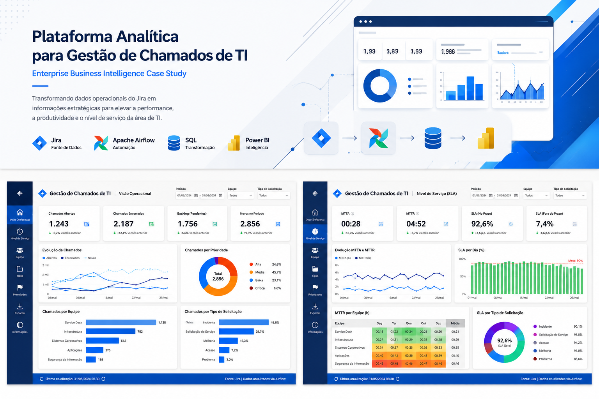
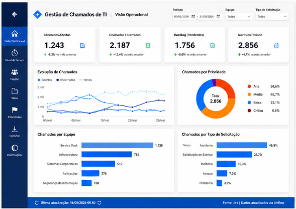
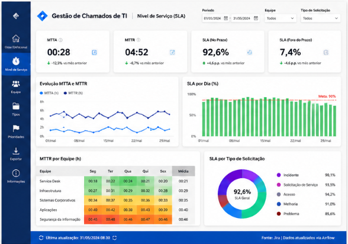

# Plataforma Analítica para Gestão de Chamados de TI (Jira)

### Enterprise Business Intelligence Case Study

> Como transformei os dados operacionais do Jira em uma plataforma analítica de performance de TI utilizando Airflow, SQL e Power BI.

 

---

# 📌 Visão Geral

Com o crescimento da área de TI, o volume de chamados registrados no Jira aumentava significativamente, mas a gestão tinha pouca visibilidade sobre o desempenho operacional da equipe — tempo médio de atendimento, volume por equipe e principais gargalos.

Para resolver esse cenário, desenvolvi uma plataforma analítica capaz de transformar os dados operacionais do Jira em informações estratégicas de performance de TI, com atualização automatizada e praticamente em tempo real.

---

# 🎯 O Desafio

Os principais desafios encontrados eram:

- Ausência de visibilidade sobre tempo médio de atendimento e resolução;
- Pouca clareza sobre volume de chamados por equipe, tipo e prioridade;
- Dificuldade em identificar gargalos operacionais;
- Estruturas JSON complexas retornadas pela API do Jira, sem tratamento padronizado;
- Falta de indicadores consolidados de nível de serviço.

---

# 💡 A Solução

Foi desenvolvida uma solução completa de Business Intelligence composta por:

- Extração automatizada dos dados via API do Jira;
- Pipelines orquestrados no Apache Airflow;
- Tratamento em SQL para normalização das estruturas JSON;
- Armazenamento no Data Lake corporativo;
- Dashboards executivos e operacionais em Power BI;
- Indicadores de nível de serviço (MTTA e MTTR).

---

# 🏗 Arquitetura da Solução

## Fonte de Dados

- API do Jira (datas, responsáveis, status, prioridades, tipos de solicitação)

## Automação

Pipelines automatizados em Apache Airflow, responsáveis pela extração periódica dos dados diretamente da API do Jira, sem intervenção manual.

## Tratamento

Estruturas JSON complexas retornadas pela API foram normalizadas em SQL, organizando os dados em tabelas consumíveis pelo modelo analítico e armazenadas no Data Lake corporativo.

## Visualização

Toda a camada analítica foi disponibilizada através do Power BI.

---

# 📊 Dashboards Desenvolvidos

## Visão Operacional

Acompanhamento de chamados abertos, encerrados, pendentes (backlog) e novos no período, com evolução diária, distribuição por prioridade e tipo de solicitação, e volume por equipe.

---

## Nível de Serviço (SLA)

Painel dedicado aos indicadores **MTTA (Mean Time to Acknowledge)** e **MTTR (Mean Time to Resolve)**, com evolução histórica, SLA cumprido por dia, MTTR por equipe e SLA por tipo de solicitação.

---

# 📈 Resultados

Principais ganhos obtidos:

- Operação de TI muito mais transparente;
- Visibilidade em tempo praticamente real, com pipelines automatizados via Airflow;
- Identificação rápida de gargalos operacionais;
- Maior capacidade de monitorar o nível de serviço da equipe de suporte;
- Redução da dependência de apuração manual dos chamados.

---

# 🛠 Stack Tecnológica

### Business Intelligence

- Power BI

### Dados

- SQL
- Apache Airflow
- Data Lake

### Integração

- API do Jira

---

# 📚 Principais Aprendizados

Este projeto reforçou a importância de estruturar bem a camada de tratamento de dados antes da modelagem analítica, especialmente ao lidar com estruturas semiestruturadas como retornos de API em JSON.

Também evidenciou como indicadores de nível de serviço, quando bem definidos, se tornam ferramentas diretas de gestão operacional para equipes de suporte.

---

# 🔒 Confidencialidade

Este estudo de caso foi adaptado para fins de portfólio.

Alguns detalhes operacionais foram abstraídos e todos os dados apresentados são ilustrativos ou anonimizados para preservar a confidencialidade do projeto original.

---

## 👤 Autor

**Paulo Oliveira**

### Data Solutions • Analytics • AI

- LinkedIn: https://www.linkedin.com/in/paulo-emilio
- Portfólio: https://paulo-emilio.github.io
- GitHub: https://github.com/paulo-emilio
